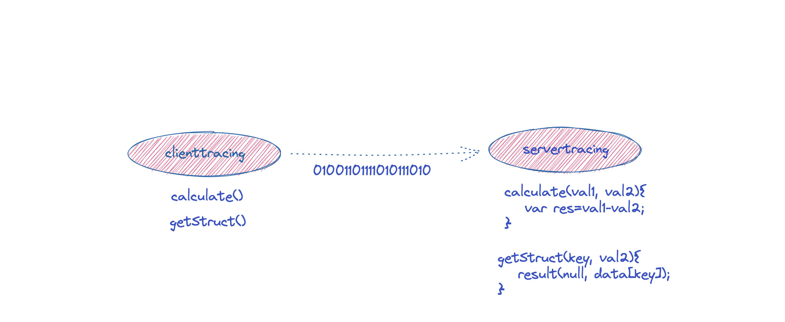
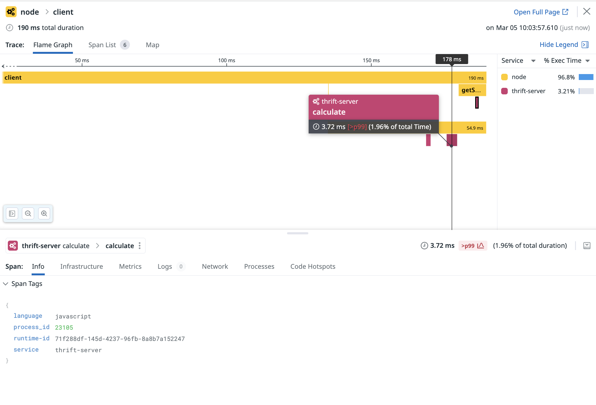
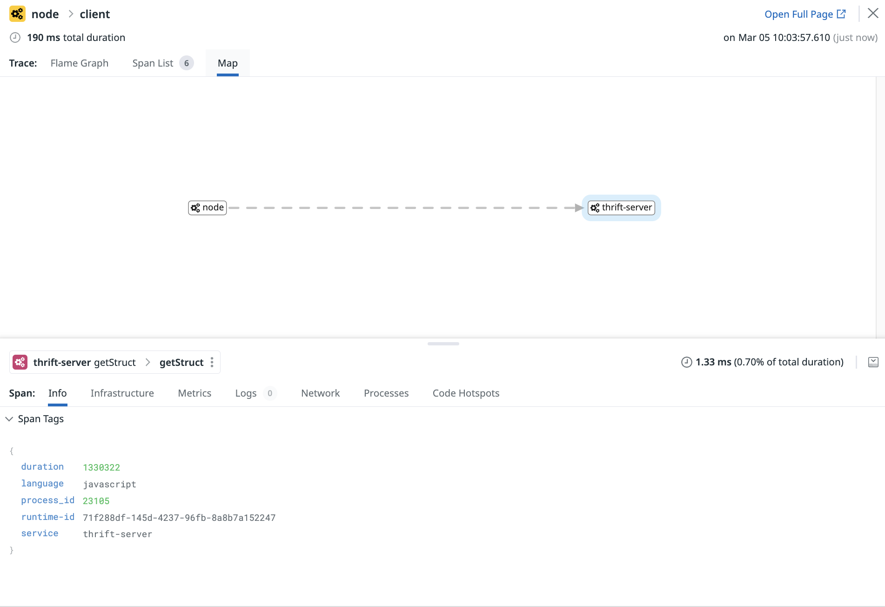

# Custom tracing of a node.js app based on thrift and using the Datadog tracing library


## Introduction


The sections of this tutorial are structured as follows

* Goal
* Pre-requisites
* Clone the repository
* Directory structure of the [project](#project)
* Overview of the [application](#app)
* Building, running and testing the application [locally](#local).
* Viewing and validating the [results](#load) 
* End

In each section, we'll describe the required steps to take in order to reach the goal.

## Goal of this tutorial

The purpose of this tutorial is to showcase the instrumention technique (custom instrumentation) for a node.js application based on thrift with Datadog and opentracing.
The original code used in this tutorial is based on the official Apache code example available here https://thrift.apache.org/tutorial/nodejs.html


<p align="left">
  
</p>


## Pre-requisites


+ About 20 minutes
+ Node.js (17.9.0), npm (8.5.5), thrift (0.18.1) on Ubuntu 18.04
+ Git client
+ Docker installed (optional)
+ A Datadog account with a valid API key
+ Your favorite text editor or IDE (Ex Sublime Text, Atom, vscode...)


## Clone the repository


<pre style="font-size: 12px">
[root@pt-instance-2:~/]$ git clone https://github.com/ptabasso2/nodethrift
[root@pt-instance-2:~/]$ cd nodethrift
[root@pt-instance-2:~/nodethrift]$ 
</pre>


## Directory structure of the <a name="project"></a>project


The example below is the structure after having clone the project.

```shell
[root@pt-instance-2:~/nodethrift]$ tree -L 2
.
├── README.md
├── clienttracing.js
├── gen-nodejs
│   ├── Calculator.js
│   ├── SharedService.js
│   ├── sharedtracing_types.js
│   └── tutorialtracing_types.js
├── node_modules
│   ├── @datadog
│   ├── dd-trace
│   ├── opentracing
│   ├── thrift
...
│   ├── through
│   ├── ws
│   └── yocto-queue
├── package-lock.json
├── package.json
├── servertracing.js
├── sharedtracing.thrift
└── tutorialtracing.thrift
```

## Overview of the <a name="app"></a>application


The main components for this project can be described as follows:
+ A client (`clienttracing`) and a server (`servertracing`) communicating with each other using `thrift`. The client making various calls to the server  </br>
+ In order to allow the communication using `thrift` we need to use beforehand the compiler it provides to generate the stub layers which are generated from the contract/IDL specified in both `tutorialtracing.thrift` and `sharedtracing.thrift`
+ Once executed, the corresponding `*.js` files will be automatically generated and placed into the `gen-nodejs` directory


### Starting the Datadog Agent first ###

First set your API Key:

````shell
[root@pt-instance-2:~/nodethrift]$ export DD_API_KEY=<Your api key>
````

Then let's run the agent. As docker is installed on our environment, we will use a dockerized version of the agent. 

But if you wish to have it deployed as a standalone service you will want to follow the instructions as per [Datadog Agent installation](https://app.datadoghq.com/account/settings?_gl=1*17qq65s*_gcl_aw*R0NMLjE2NzY0Mzg4NTcuQ2p3S0NBaUFfNnlmQmhCTkVpd0FrbVh5NTcxNlplWmxIQ3RBS0MwdWdUeWIyNnZSRGN1Q01YUHJoZHlYU2Zaekt4eTNNZjZST1I4SVVSb0NwT2NRQXZEX0J3RQ..*_ga*NzYyNTQxODI3LjE2MDExNDI4ODA.*_ga_KN80RDFSQK*MTY3NjgwOTY3NS4zMC4xLjE2NzY4MDk3MDQuMzEuMC4w#agent/ubuntu)


By default, the Datadog Agent is enabled in your `datadog.yaml` file under `apm_config` with `enabled: true` and listens for trace data at `http://localhost:8126`


````shell
[root@pt-instance-2:~/nodethrift]$ docker run -d --network app --name dd-agent-dogfood-jmx -v /var/run/docker.sock:/var/run/docker.sock:ro \
-v /proc/:/host/proc/:ro \
-v /sys/fs/cgroup/:/host/sys/fs/cgroup:ro \
-v /home/pej/conf.d/:/etc/datadog-agent/conf.d \
-p 8126:8126 -p 8125:8125/udp \
-e DD_API_KEY \
-e DD_APM_ENABLED=true \
-e DD_APM_NON_LOCAL_TRAFFIC=true -e DD_PROCESS_AGENT_ENABLED=true -e DD_DOGSTATSD_NON_LOCAL_TRAFFIC="true" -e DD_LOG_LEVEL=debug \
-e DD_LOGS_ENABLED=true \
-e DD_LOGS_CONFIG_CONTAINER_COLLECT_ALL=true \
-e DD_CONTAINER_EXCLUDE_LOGS="name:datadog-agent" \
-e SD_JMX_ENABLE=true \
gcr.io/datadoghq/agent:latest-jmx
Unable to find image 'gcr.io/datadoghq/agent:latest-jmx' locally
latest-jmx: Pulling from datadoghq/agent
8dbf11a29570: Pull complete 
Digest: sha256:c7fe7c8d15f259185ab0c60dbfb7f5cbc67d09b5749af0d2fee45cefe2ccb05f
Status: Downloaded newer image for gcr.io/datadoghq/agent:latest-jmx
2d1eec89c2196d298d1e3edf1e9f879c0fc3be593d96f1469cfacc2cacfc18b4
````


## Configuring <a name="env"></a> the application environment.

In order to instrument our services, we will also need to use the node.js tracing library (`dd-trace-js`). 

For more details you may want to check the following repository [dd-trace-js](https://github.com/DataDog/dd-trace-js)
 
To install the node.js tracing library, we will add it by using npm `npm install dd-trace`. The opentracing api will also be used together with `dd-trace` therefore the corresponding package (`opentracing`) will need to be added as well. 

Lastly, we will add the `thrift` package as this will be used to handle the communication operations between the client and the server. 


## Building, running and testing <a name="local"></a> the application locally.

**Build step (optional)**

These steps assume that you have a `node.js`, `npm` and `thrift` installed and configured for your environment. This tutorial has been tested with node `v17.9.0`, npm `8.5.5` and thrift `0.18.1`.

The build step essentially consists of running the following commands that call out the thrift compiler. This step is optional as this repository already has them, therefore you can simply reuse them and run the application. 

````shell
[root@pt-instance-2:~/nodethrift]$ thrift -r --gen js:node tutorialtracing.thrift
[root@pt-instance-2:~/nodethrift]$ thrift -r --gen js:node sharedtracing.thrift 
````

This will create the `gen-nodejs/` and add four new files as per the what has been defined in the contract files.

````shell
├── gen-nodejs
│   ├── Calculator.js
│   ├── SharedService.js
│   ├── sharedtracing_types.js
│   └── tutorialtracing_types.js
````


**Running and testing the application locally**

At this stage we have the Datadog agent running and configured to send telemetry and traces data.
We can now move on and launch the server component.

````shell
[root@pt-instance-2:~/nodethrift]$ node servertracing.js

````

Open an another shell and run now the client:

````shell
[root@pt-instance-2:~/thrift]$ node clienttracing.js
ping()
InvalidOperation InvalidOperation: InvalidOperation
15-10=5
1+1=undefined
Check log: 5
````

After the sequence of calls, you should be able to see the following output on the server side

````shell
[root@pt-instance-2:~/thrift]$ node servertracing.js
ping()
calculate( 1 , { num1: 1, num2: 0, op: 4, comment: null } )
calculate( 1 , { num1: 15, num2: 10, op: 2, comment: null } )
add( 1 , 1 )
getStruct( 1 )
````

This means that the communication takes place and works as expected. You may want to run the command a few times to generate a bit of load.


## Viewing and validating <a name="load"></a> the results 

After having run the client several times and after 20/30 seconds, we can check that our services are being instrumented and that the details are reflected in this trace flamegraph. 

<p align="left">
  
</p>

</br>


Besides we can also visualize the topology representation of this call

<p align="left">
  
</p>


## End
